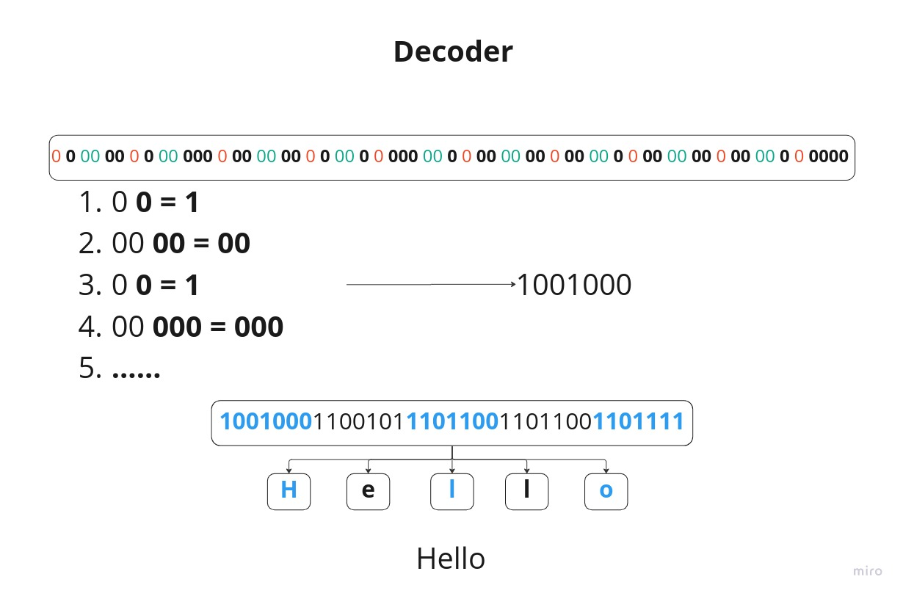

# Chuck-Norris-Cipher-Encoder-Decoder

Encryption that uses only one character and space.

## Features

- Encoder
- Decoder

## How it Works

### Encoder
1. Divide an encrypted message into the characters that it contains
2. Convert each character of a string into a binary form.
   Any ASCII character has a size of `7` bits; in binary, the form is `0` and `1`.
   For example, the character `A` has a decimal value of `65`.
   The binary representation is `1000001`.
   `b` is `98` in decimal or 1100010 in binary.
   The space character is `32` in decimal value or `0100000` in binary.
3. The encoded output message consists of blocks of `0`. A block is separated from another block by a space.
   Two consecutive blocks are used to produce a series of the same value bits (only `1` or `0` values):
   **First block:** it is always `0` or `00`. If it is `0`, then the series contains `1`, if not, it contains `0`
   **Second block:** the number of 0 in this block is the number of bits in the series

### Decoder

#### Validation
If the user provided an incorrect encoded message as input to decode, the program should print out appropriate feedback containing `not valid` substring
List of not valid encoded messages:

- The encoded message includes characters other than `0` or spaces;
- The first block of each sequence is not `0` or `00`;
- The number of blocks is odd;
- The length of the decoded binary string is not a multiple of `7`.

#### Decoding

1.Split blocks of zeros and group those blocks by two. Then decode these blocks like in the previous stage:
`0 0` is `1`
`00 0000` is `0000`
`0 000` is `111`
`00 0000` is `0000`
`0 00` is `11`
1. Concatenate the lines above, which gives us `10000111000011`.
2. split the result into blocks of seven symbols (binary form) and convert these blocks to characters.
3. convert them into characters.